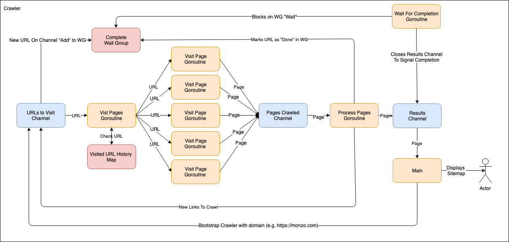

# Web Crawler

## Build/Run

```
go build
./web-crawler https://bbc.co.uk
```

## Dependencies
```
github.com/stretchr/testify/assert
golang.org/x/net/html
```

## Components

The main component is a `Crawler` that is constructed with a domain to visit and is responsible for crawling the domain specified.

`Page` objects are crawled HTML pages in a domain which contain the links to other pages.

The only operation that can be performed on a `Crawler` object is `Crawl`. `Crawl` starts the crawling process off, immediately returning a channel that emits the `Page` objects as they are crawled. When that channel is closed by the `Crawler` object then that signals that crawling has completed.

## Design



The _URLs to Visit_ channel contains all the URLs that should be visited, potentially including URLs that have already been visited or are not on the domain that is being crawled.

The _Visit Pages_ goroutine is responsible for processing the _URLs to Visit_ channel. It checks if a URL has already been visited, also checking if the URL is for the domain that is being crawled. It launches a _Visit Page_ goroutine with a single URL parameter for ech url that is required to be crawled. This means each url to visit and crawl is handled by a new goroutine. 

The _Visit Page_ goroutine performs a HTTP get on the url provided to it, processes the response and builds a `Page` object containing the url and any links from the page.

The _Pages Crawled Channel_ buffers all the `Page` objets produced by _Visit Page_ goroutines.

The _Process Page_ goroutine process the _Pages Crawled_ channel and sends all links from the page to the _URLs To Visit_ Channel. It also has the responsibility of performing the `Add` and `Done` operations on the Complete Wait Group. The last operation performed is pushing the `Page` object on the _Results_ channel to be consumed by `main`

The _Complte_ Wait Group acts as a way of allowing the crawler to know when all relevent urls have been visited on a domain. When a new url is found to crawl the Wait Group has an `Add` operation performed on it. When a url is either disregarded or visited then the `Done` operation is performed on it. When callers to the `Wait` operation unblock then all relvant urls should have been visited. 

The _Wait For Completion_ goroutine blocks on the _Complete_ Wait Group with a `Wait` operation. When that `Wait` operations unblocks it then closes the Results channel to signal to clients that the crawling has completed. 
